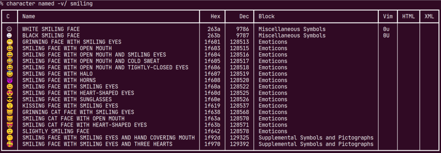
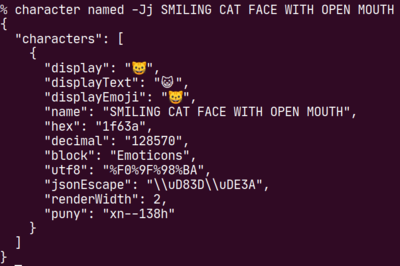

character
=========

[](http://travis-ci.org/philpennock/character)

This is a tool for various manipulations on characters, as characters rather
than full strings, to show names, encodings and more.

The tool is structured as a top-level command, options, and sub-commands which
can do different things.  Many sub-commands will take a `-v` verbose option,
which gives more detail in a pretty-printed table.

```console
$ character help
[... lists all available sub-commands ...]
$ character version
[...]
$ character name ✓
CHECK MARK
$ character named -h
[...]
$ character named 'CHECK MARK'
✓
$ character named -j CHECK MARK
✓
$ character named -v/ check
[... table of results of substring search ...]
$ character browse -b 'Alchemical Symbols'
[... table of results; browse is always a table ...]
$ character transform fraktur Hello world
ℌ𝔢𝔩𝔩𝔬 𝔴𝔬𝔯𝔩𝔡
$ character named -1c 'INFORMATION DESK PERSON' \
    'EMOJI MODIFIER FITZPATRICK TYPE-5'
💁🏾
```

In the last example, note that `-c` copies to clipboard; using `-vc` shows the
results in a table but copies only the characters to the clipboard.  Without
`--oneline` (`-1`) each non-verbose character is shown on its own line.  In
this example we're using an emoji modifier which needs to immediately follow
the modified character, so `-1c` _should_ show you the same thing that is
copied to the clipboard where `-c` on its own would show you the individual
parts while copying the modified/combined whole to the clipboard.






[Licensed](./LICENSE.txt) under a MIT-style license.  
[Accumulated licenses of all dependencies](./LICENSES_all.txt) are available
too.  
Patches welcome.


Building
--------

Run: `go build`

Assuming defaults, install into `~/go/bin/` with: `go build`

This software uses Go Modules and requires a sufficiently recent version of
Go.  Clone this repo anywhere, don't worry about `$GOPATH` or such things
(assuming Go 1.12 or newer).

If you are on an older Go, look for the last release in the `v0.3.x` series.

### WASM

Run: `./util/make_wasm.sh`

A directory `wasm` will be created; the `character` binary will be compiled
into there as `main.wasm`; a supporting HTML page will be copied in, as well
as the Golang `wasm_exec.js` support page.

Run a web-server which serves up the content of the `wasm/` directory and see
how it works.  We should perhaps have a way to default to verbose mode (for
tables) to better support this use-case.

**SECURITY NOTE**: Note: to have tables work, I switched from `innerText` to
`innerHTML`, but this early proof-of-concept is not escaping output to be
proof against HTML injection attacks.  In particular, an unknown command will
be echo'd back in the error message, as is fairly common for Unix CLI tools.
We could use a separate output area for errors and use `innerText` for that,
but that doesn't solve, eg, the output of transform commands which
deliberately make reversible changes to input and displays it.

So don't put this up somewhere public, at least not in a domain with access to
any cookies or other credentials worth stealing.  But it's a useful toy to
explore with.  Well, it was for me: "My First WASM".


Table packages
--------------

Rendering content to tables requires a table package.  We default to my own
package, `go.pennock.tech/tabular`.  We originally used
`github.com/apcera/termtables` and briefly tried
`github.com/olekukonko/tablewriter` before switching to writing my own.

(Apcera's repositories have disappeared, the most widespread fork of
`termtables` appears to be `github.com/xlab/tablewriter`).

You can use Go build tags to switch the table package used.  I might remove
support for this in the future.


Alternatives
------------

* `uni` by Martin Tournoij: <https://github.com/arp242/uni>,
  `go get arp242.net/uni`
