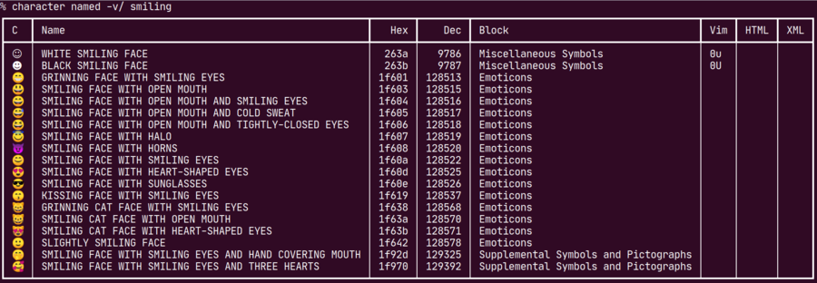
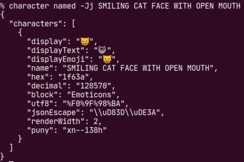

character
=========

[](https://github.com/philpennock/character/actions/workflows/pushes.yaml)

This is a tool for various manipulations on characters, as characters rather
than full strings, to show names, encodings and more.

The tool is structured as a top-level command, options, and sub-commands which
can do different things.  Many sub-commands will take a `-v` verbose option,
which gives more detail in a pretty-printed table.

```console
$ character help
[... lists all available sub-commands ...]
$ character version
[...]
$ character search check
[... table of results; search is convenience alias ...]
$ character name ✓
CHECK MARK
$ character named -h
[...]
$ character named 'CHECK MARK'
✓
$ character named -j CHECK MARK
✓
$ character named -v/ check
[... table of results of substring search ...]
$ character browse -b 'Alchemical Symbols'
[... table of results; browse is always a table ...]
$ character transform fraktur Hello world
ℌ𝔢𝔩𝔩𝔬 𝔴𝔬𝔯𝔩𝔡
$ character transform scream Hello world
A̰áăăå ȁåȃăa̱
$ character transform scream --decode \
    $(character transform scream Hello world)
Hello world
$ character named -Jj CHECK MARK
{"characters":[{"display":"✓","name":"CHECK MARK","hex":"2713",...}]}
$ character named -1c 'INFORMATION DESK PERSON' \
    'EMOJI MODIFIER FITZPATRICK TYPE-5'
💁🏾
```

In the last example, note that `-c` copies to clipboard; using `-vc` shows the
results in a table but copies only the characters to the clipboard.  Without
`--oneline` (`-1`) each non-verbose character is shown on its own line.  In
this example we're using an emoji modifier which needs to immediately follow
the modified character, so `-1c` _should_ show you the same thing that is
copied to the clipboard where `-c` on its own would show you the individual
parts while copying the modified/combined whole to the clipboard.

Use `-J` / `--json` for machine-readable output — this is the most reliable
format for scripting and agent consumption (but consider MCP invocation).






[Licensed](./LICENSE.txt) under a MIT-style license.  
[Accumulated licenses of all dependencies](./LICENSES_all.txt) are available too.  
Patches welcome.


## Agent and MCP support

The `agent` sub-command tree has commands designed for AI coding agents and
other automated tooling.  All agent output is stable, machine-readable JSON.
AIs should see [`AGENTS.md`]() for full tool schemas and usage patterns.

`character agent mcp` starts a [Model Context Protocol][mcp] stdio server.
This allows `character` to act as a co-process providing Unicode domain
knowledge.

[mcp]: https://modelcontextprotocol.io/

(Disclosure: Claude was used to implement the MCP support.)

(Added in v0.10.0)

**Schema stability:** The MCP tool schemas (parameter names, types, and
response shapes) may change incompatibly across any release, including patch
versions.  Clients must discover schemas at runtime via the MCP `tools/list`
method rather than hard-coding parameter knowledge.

### Registering as an MCP server

#### Claude Code

Register the MCP server:

```sh
claude mcp add --scope user --transport stdio character -- character agent mcp
```

This registers the agent as available for all Projects;
drop the `--scope user` to only make available to this specific project.

The server returns an `instructions` field in its MCP initialize response,
which Claude Code uses to discover the Unicode tools automatically via Tool
Search — no additional configuration is needed for basic usage.

**Installing the custom slash command** (optional): the file
[`extra/character-unicode.md`]() provides a deeper reference — a
tool-routing decision table, the full property field reference, and advanced
tips.  Install it as a custom slash command for on-demand access:

```sh
# from the character source tree
mkdir -pv ~/.claude/commands
cp -v extra/character-unicode.md ~/.claude/commands/./
```

Once installed, type `/character-unicode` in a Claude Code session to load the
extra guidance into context.  The server's `instructions` text references the
command, so Claude can load it when detailed guidance is needed.

#### Other MCP clients

Any client that supports the MCP stdio transport can launch `character agent
mcp` as a subprocess.  The server speaks JSON-RPC 2.0 with newline-delimited
framing (one JSON object per `\n`-terminated line).  Clients that support the
MCP `instructions` field will receive discovery guidance and key usage patterns
automatically.


## Documentation

| File                             | Audience                                                                            |
| -------------------------------- | ----------------------------------------------------------------------------------- |
| [`AGENTS.md`]()                  | AI agents — tool schemas, example invocations, output formats                       |
| [`CODE_GUIDE.md`]()              | Developers — package map, reading order, data flow, protocols                       |
| [`extra/character-unicode.md`]() | AI agents — tool-routing table, property field reference, Claude Code slash command |

[AGENTS.md]: AGENTS.md
[`AGENTS.md`]: AGENTS.md
[CODE_GUIDE.md]: CODE_GUIDE.md
[`CODE_GUIDE.md`]: CODE_GUIDE.md
[extra/character-unicode.md]: extra/character-unicode.md
[`extra/character-unicode.md`]: extra/character-unicode.md

## Building

Requires Go 1.24 or newer.

Install without cloning:

```sh
go install github.com/philpennock/character@latest
```

Or clone and build locally:

```sh
git clone https://github.com/philpennock/character.git
cd character
go build
```

Unicode data and entity tables are compiled in.  To regenerate them after
updating source data files (e.g. for a new Unicode version):

```sh
go generate ./...
```

### WASM

Run: `./util/make_wasm.sh`

A directory `wasm` will be created; the `character` binary will be compiled
into there as `main.wasm`; a supporting HTML page will be copied in, as well
as the Golang `wasm_exec.js` support page.

Run a web-server which serves up the content of the `wasm/` directory and see
how it works.  We should perhaps have a way to default to verbose mode (for
tables) to better support this use-case.

**SECURITY NOTE**: Note: to have tables work, I switched from `innerText` to
`innerHTML`, but this early proof-of-concept is not escaping output to be
proof against HTML injection attacks.  In particular, an unknown command will
be echo'd back in the error message, as is fairly common for Unix CLI tools.
We could use a separate output area for errors and use `innerText` for that,
but that doesn't solve, eg, the output of transform commands which
deliberately make reversible changes to input and displays it.

So don't put this up somewhere public, at least not in a domain with access to
any cookies or other credentials worth stealing.  But it's a useful toy to
explore with.  Well, it was for me: "My First WASM".


## Table packages

Versions prior to v0.9.0 supported multiple table packages for rendering tables
to the terminal.  With v0.9.0, we dropped support for all table packages other
than by own `go.pennock.tech/tabular`, support for which was added in v0.1.0.


## Alternatives

* `uni` by Martin Tournoij: <https://github.com/arp242/uni>
  — `go install arp242.net/uni/v2@latest`
* `unicode` (Debian/Ubuntu): `apt install unicode`
  — command-line Unicode database query tool
* `unipicker` by Jeremy Janzen: <https://github.com/jeremija/unipicker>
  — interactive console Unicode character picker with clipboard support
